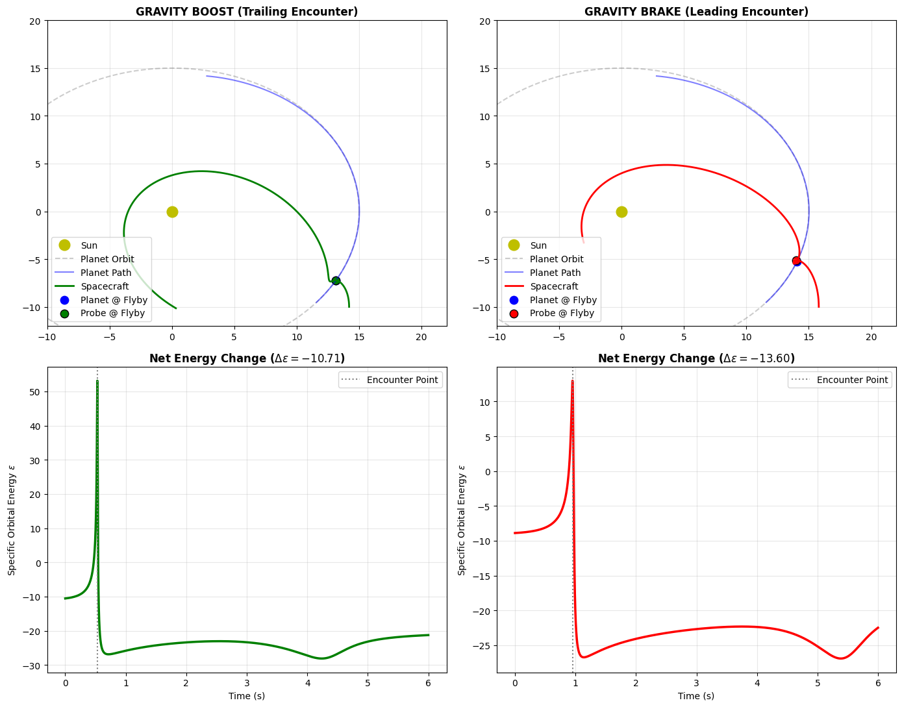

# Planetary Gravity Assist Simulation in a 3-Body System

A first-principles computational physics project modeling planetary gravity assists (slingshot maneuvers) using a synchronized 3-body numerical integrator in Python.

## Overview
- **Methodology:** Semi-implicit Euler-Cromer $N$-body gravitational integration ($\Delta t = 0.0005\text{ s}$).
- **Flyby Dynamics:** Demonstrates how a trailing-edge encounter extracts orbital momentum from the planet to increase heliocentric specific orbital energy ($\Delta \epsilon > 0$), while a leading-edge encounter transfers energy back to the planet, braking the spacecraft into a lower orbit ($\Delta \epsilon < 0$).
- **Conservation of Energy:** Verifies that the apparent energy boost in the heliocentric frame is balanced across the total coupled 3-body system.

## Governing Equations
- **Newtonian Gravitational Acceleration:** $\vec{a}_i = \sum_{j \neq i} \frac{G M_j}{|\vec{r}_j - \vec{r}_i|^3} (\vec{r}_j - \vec{r}_i)$
- **Heliocentric Specific Orbital Energy:** $\epsilon = \frac{1}{2} v^2 - \frac{G M_{\text{star}}}{r}$

## Repository Contents
- `gravity_assist_simulation.ipynb`: Python simulation notebook with orbital synchronization and Matplotlib visualization routines.
- `download.png`: Output figure illustrating 2D trajectory deflections alongside the corresponding specific energy step functions.
