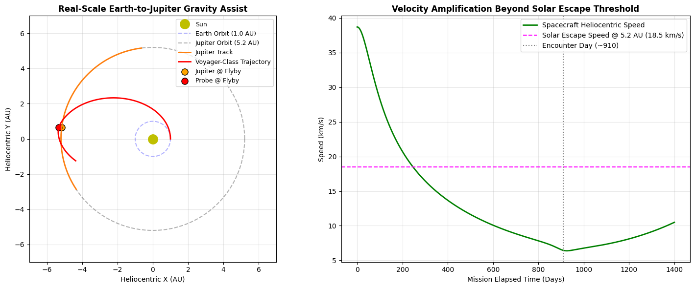

# Real-Scale Interplanetary Gravity Assist & Escape Trajectory Simulator

A computational orbital mechanics simulation in Python modeling real-scale planetary gravity assists (slingshot maneuvers) using SI astronomical units and a 3-body numerical integrator.

## Overview
- **Astrodynamics Framework:** Direct $N$-body numerical integration using semi-implicit Euler-Cromer / Symplectic integration with physical constants ($G$, $M_{\odot}$, $M_{\text{Jupiter}}$, $M_{\oplus}$, $1\text{ AU} = 1.496 \times 10^{11}\text{ m}$).
- **Mission Profile (Voyager Analog):** 
  - Spacecraft is injected from Earth's orbital boundary ($1.0\text{ AU}$) onto a heliocentric Hohmann transfer ellipse ($a = 3.102\text{ AU}$, $v_{\text{launch}} = 38.71\text{ km/s}$).
  - Transits deep space over $\approx 910\text{ days}$ to encounter Jupiter at $5.204\text{ AU}$.
  - Performs a trailing-edge hyperbolic flyby, extracting orbital momentum from Jupiter and reversing heliocentric deceleration into positive acceleration without fuel consumption.

## Governing Equations
- **$N$-Body Gravitational Acceleration:**
  $$\vec{a}_i = \sum_{j \neq i} \frac{G M_j}{|\vec{r}_j - \vec{r}_i|^3 + \delta^3} (\vec{r}_j - \vec{r}_i)$$

- **Solar Escape Speed at Radius $r$:**
  $$v_{\text{esc}}(r) = \sqrt{\frac{2 G M_{\odot}}{r}}$$
## Repository Structure
- `gravity_assist_simulation.ipynb`: Complete Python notebook containing both normalized 3-body synchronization experiments and real-scale SI Earth–Jupiter trajectory models.
- `voyager_jupiter_flyby.png`: Real-scale astronomical trajectory plot and heliocentric velocity amplification curve.
